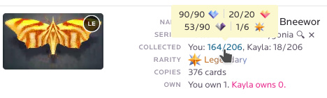

# NeonMob Trade Enhancements

Adds enhancements to improve trading and usage experience.

# Installation

1. To use usercripts, you need an appropriate extension. 
I recommend Tampermonkey 
([Chrome Webstore](https://chrome.google.com/webstore/detail/tampermonkey/dhdgffkkebhmkfjojejmpbldmpobfkfo), 
[Firefox Add-ons](https://addons.mozilla.org/ru/firefox/addon/tampermonkey/)).
2. Then you need to 
[download the userscript](https://github.com/7nik/nm-trade-enhancements/releases/latest/download/userscript.user.js) 
and the extension will automatically offer you to install it.

# Provided Features

## The Trade Window

### New filtering system
The card filters are replaced with another one, much more powerful.

Firstly, it allows you to save filters and quickly switch between them. And, if 
you name a filter set `default`, it will be applied at the beginning of the trade. 

Then goes the section with series-based filters.
The first one defines the range of collected cards in your or your partner's 
series to show it. A resetting button follows it. In the following line, two 
toggles allow showing only series shared with the partner and series the partner 
hasn't completed yet. Finally, a series chooser show only series matching the 
filters mentioned above. It supports searching and shows core series and special 
series progress.

The last line allows filter series by the following types:
* Out of print series;
* Limited series with credit packs only;
* Limited series with carat packs or freebies;
* Unlimited series;
* Replica Edition and Infinite Edition.

The last section contains card-based filters. They allow:
* Show only wishlisted cards;
* Show only cards from common series;
* Hide cards used in other trades;
* Set card rarity;
* Show only cards of which you or the partner own a certain number of copies;
* Show only cards with the card count in a specific range.

At the top of the trade window, you'll find the list of applied filters and their parameters.

### The card features
If the print is used in another trade, there will be an icon in the card's upper right corner.

Around the series name, you can find an icon to set this series to the series chooser.

The neighbor icon allows you to hide the series from search results.
The hidden series are listed below the applied filters.

Now, the card info contains the progress of your and your partner's collections. 
In addition, its tooltip shows a bit more information. Thus you can estimate 
partner interest in cards from this series.

Once you have added a card, you can change the print number to trade by clicking 
it. The prints used in trade will be marked. But, for the sake of users who aren't 
aware of NMTE, you can change the print number only of the your cards.

### Overthought to counter or modify a trade? Not a problem
Now, there is a button to cancel all the changes and return to the original trade.

### Last user activity
Now the conversation window shows how far ago the partner did something.

Note that this means the last public activity but not the last site visit.

## Auto-withdrew fix
Now you'll get notifications about auto-withdraw trades.

Note, it just remembers your trades and displays auto-withdrawn ones. So if you 
make a trade on another device and it gets completed before NMTE sees it, there 
will be no notification.

## The card used in trade
Like in trade, cards involved in trading will have a corresponding icon on the 
collection and series pages.

## Trade previews
Now, when you hover in the sidebar the trades list or a trade notification, a 
trade preview will appear.

Also, it will appear when you hover over the icon of using the card in trading.

## Single click instead of hundreds
Just select the rarities you want to get or nothing if you want everything and 
wishlist all these unowned cards in one click! 

Use the wishlist filter to toggle into unwishlisting mode.

## Open promo packs only when you want
Now your account setting has an option to use the promo button instead of the 
promo page (by default, it's off). When the option is enabled, links with promo 
packs will redirect you to the series page, where you can decide whether you want 
to open the pack or not.

## Peep the colored version of a card
On detailed view, press and hold the card image to see its colored (or animated) 
version, even if you do not own it.

## Hotkeys
* More proper behavior when Escape pressed;
* Use Enter/Spacebar to accept the confirmation and Escape to decline;
* Use the Left and Right keys on the detailed view to go to neighbor cards.

## Various
On the series page, the detailed card view also has buttons to see neighbor cards.

Cards in trades will be sorted by rarity, so matching them is easier.

If you want to know the exact number of owners/seekers - hover over the text.

Now, if you own an animated card, you will see even better quality on the detailed view!

When you return to the list of needers or seekers, it won't load from zero.
